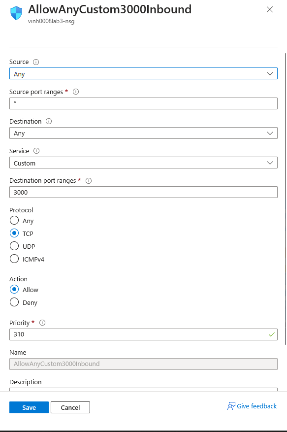
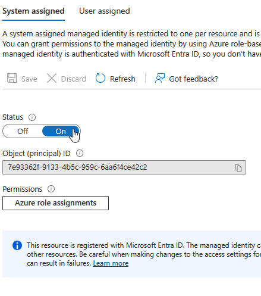
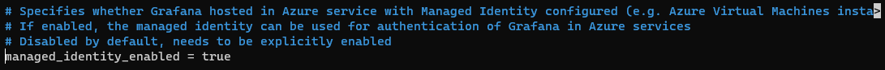
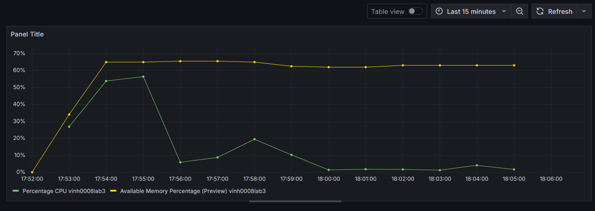

# CST8919 Lab 3
## Steps Taken
1.	SSH into the Ubuntu virtual machine.
2.	Install Grafana.
3.	Add port 3000 as an allowed inbound port to the network security group:

4.	Enable system assigned managed identity:
 
5.	Run ```sudo nano /etc/grafana/grafana.ini```.
6.	Use Ctrl+W to search for `managed_identity_enabled`.
7.	Uncomment the line, then set it to true:

8. Save the file.
9. Restart Grafana using:
```
sudo systemctl stop grafana-server
sudo systemctl start grafana-server
```
10. Find your Azure virtual machine's public IP address.
11. Navigate to <public_ip>:3000 in your browser.
12. Log into Grafana using the default username of `admin` with password `admin`.
13. Add Azure Monitor as a data source.
14. Create a dashboard, add the metrics you want.
## Final Dashboard
